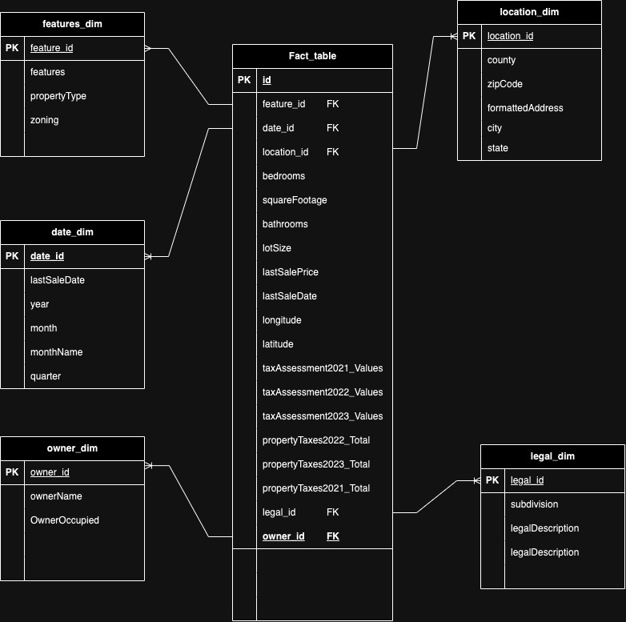
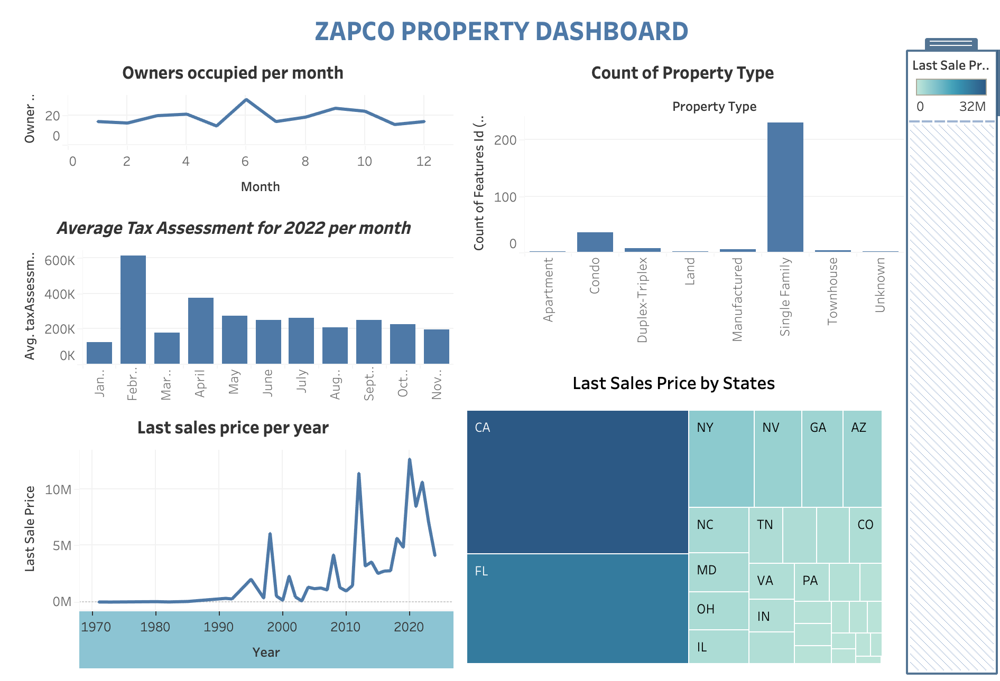

# zipco_real_estate_data-modeling

# Developing a Robust ETL Pipeline for Property Records in Real Estate Using PostgreSQL for UrbanNest Realty

## Tools and Methodology

  - RapidAPI: This is used to extract real estate data.
  
  - PostgreSQL: A relational database for storing the property data.
  
  - Python: For data extraction, transformation, and loading (ETL process).
  
  - Windows Task Scheduler / Cron: For scheduling periodic tasks to extract and load data.
  
  - GitHub: For version control and documentation.

## Step-by-Step Guide

  ## Create GitHub Repository
  
  Go to GitHub and create a new repository**:
  
  Choose a repository name (e.g., real-estate-data-pipeline)**.
    
  Select the option to initialize with a README file.**    
  
  Add a .gitignore for Python to exclude unnecessary files.

## Set Up the Project Environment

**Install required libraries by creating a requirements.txt file:**

bash
Copy code
psycopg2
requests
pandas
dash
plotly
schedule  # For task automation

#### Install the dependencies:

pip install -r requirements.txt

## Extract Data from RapidAPI

Sign up for RapidAPI, search for a Realty Mole Property, and subscribe to the API.

Obtain the API key.

Use Python's requests library to connect and fetch data.

## Transformation of Data

After extracting the data, we'll apply transformations to clean and prepare the data for the database:

## Load Transformed Data into PostgreSQL

#### Connect to PostgreSQL

Install PostgreSQL and set up a local database.**

Create a PostgreSQL connection using psycopg2.**

Create Fact and Dimension Tables**

## Here is the link to see python codes and workings 

## Data Modeling

#### Create a Star Schema:

##### Fact Table: Central table containing metrics like property sales, area, bedrooms, etc.

##### Dimension Tables: Reference tables for location, features, and date details.

### Schema Design:

  Location Dimension: Attributes like county, state, zipCode.

  Features Dimension: Attributes like propertyType, zoning, features.

  Date Dimension: Attributes like year, month, lastSalePrice etc

  owner Dimension: Attributes like ownerName, OwnerID etc

  Fact Table: Links the dimensions table using their foreign keys

## Dashboard Viz

Connect to any of the virtualization tools (Power BI, Tableau etc) to create a simple Dashboard using any metrics of your choice

Here 

## Push Changes to GitHub

Once you have made updates, push your changes to GitHub:

git add .

git commit -m "Initial setup for ETL pipeline and dashboard"

git push origin main
 
 ## Automate the ETL Process
 
To automate the ETL process, you can schedule the scripts to run periodically using Windows Task Scheduler (for Windows) or Cron (for Linux/Mac)**

#### For Windows Task Scheduler:

#### Open Task Scheduler.

Create a new task, and set the trigger to run the Python ETL scripts at a specified time (e.g., daily).

Set the action to run the Python script (python path_to_script.py).

For Cron (Linux/Mac):

Edit the crontab file to schedule the ETL task:

type crontab -e in your terminal

Add the following line to run the ETL task every day at midnight:

**0 0 * * * (followed by script path)**

## Additional Notes
Ensure that your PostgreSQL credentials (username, password, database name) are correctly set in the load_data.py and extract_data.py scripts.

If you're using Cron for automation, make sure the correct path to Python and your script is specified in the crontab.

